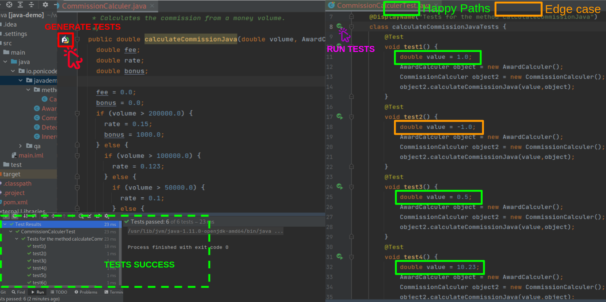

# Introduction
You are about to follow a <ins> **3 minutes** </ins> end to end tutorial to show you <ins>**how to use Ponicode**</ins> to <ins>**detect bugs**</ins>, <ins>**prevent regressions**</ins>, increase your <ins>**code quality**</ins> and <ins>**coverage**</ins> by generating <ins>**unit tests**</ins>.

Tutorial of use cases for Javascript and Typescript is available on this video [HERE](https://ponicode.com).

# Setup Ponicode [Optional]
If you have not installed our extension do it for free in the [IntelliJ marketplace](https://plugins.jetbrains.com/plugin/17980-ponicode).

# Use cases
## Generate boilerplating test with Ponicode Flash Test

- Open the [CommissionCalculer.java file](./src/main/java/io/ponicode/javademo/CommissionCalculer.java)
- Click in the body of the function `calculateCommissionJava`
- You should see a pony appearing at the left of the function definition
- Click left on the pony
- Et voilà! You should see 5 to 6 test cases generated including <ins>**happy paths**</ins> and <ins>**edge cases**</ins>
- Flash test takes care of the most tedious part of testing: Syntax and testing multiple scenario
- Click on the green play button on your test file to see your test passing 

