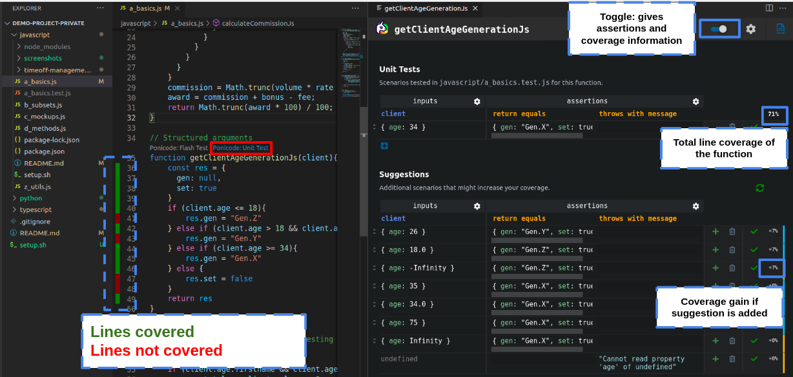
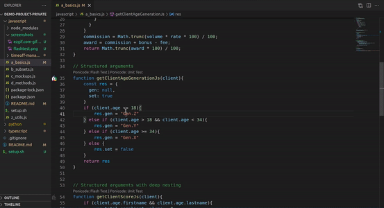
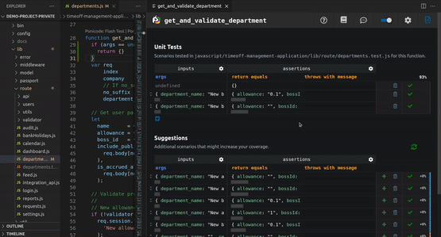

# Introduction
You are about to follow a <ins> **3 minutes** </ins> end to end tutorial to show you <ins>**how to use Ponicode**</ins> to <ins>**detect bugs**</ins>, <ins>**prevent regressions**</ins>, increase your <ins>**code quality**</ins> and <ins>**coverage**</ins> by generating <ins>**unit tests**</ins>
All this tutorial is available on this video [HERE](https://ponicode.com)

# Setup Ponicode [Optional]
If you have not installed our extension do it for free in the [VSCode Marketplace](https://marketplace.visualstudio.com/items?itemName=ponicode.ponicode).

# Install dependencies
Ponicode uses a runner to verify that your tests pass. For this you should verify that needed packages are installed.
If not already done just enter this command in the `javascript` folder

```
cd path/to/demo-project/python
bash setup.sh
```

# Use cases
## Generate boilerplating test with Ponicode Flash Test

- Open the [a_basics.py file](./a_basics.py)
- Click in the body of the function `calculate_commission_py`
- You should see two decorators appearing above your function `Ponicode:Flash Test` and `Ponicode:Unit test`
- Click on `Ponicode:Flash Test`
- Et voilà! You should see 5 to 6 test cases generated including <ins>**happy paths**</ins> and <ins>**edge cases**</ins>
- Flash test takes care of the most tedious part of testing: Syntax and testing multiple scenario


## Increase and visualize code coverage with Ponicode Unit test
⚠️ DISCLAIMER: Lines visualization is available only in Javascript. For Python you can visualize code coverage by using `pytest` :) If you want lines visualization for Python send us a message in [our community slack](https://app.ponicode.com/slack)
- Open the [a_basics.py file](./a_basics.py)
- Click in the body of the function `get_client_age_generation_py`
- You should see two decorators appearing above your function `Ponicode:Flash Test` and `Ponicode:Unit test`
- Click on `Ponicode:Unit test`
- An interface will open on the right with two sections `Unit tests` and `Suggestions`. Section `Unit tests` represents all your existing test cases. Section `Suggestions` is a list of representations of test cases that Ponicode's AI engine thinks you should pick from to increase your code quality.
- You can click the <ins>**toggle**</ins> button next to the <ins>**settings**</ins> button to get asssertions on expected values and see coverage information
- The `Suggestions` are then filtered by coverage gain. Each time you click on <ins>**+**</ins> for a suggestion, you are generating a test in your test file.



## Prevent regressions and bugs with Ponicode Unit test (example in Javascript and you can do it the exact same way in Python)
- Go in [Javasript folder](../javascript/)
- Install the dependencies 
```
cd path/to/demo-project/javascript && bash setup.sh
```
- Open the [departments.js file](../javascript/timeoff-management-application/lib/route/departments.js)
- Click in the body of the function `get_and_validate_department`
- You should see two decorators appearing above your function `Ponicode:Flash Test` and `Ponicode:Unit test`
- Click on `Ponicode:Unit test`
- An interface will open on the right with two sections `Unit tests` and `Suggestions`. Section `Unit tests` represents all your existing test cases. Section `Suggestions` is a list of representations of test cases that Ponicode's AI engine thinks you should pick from to increase your code quality.
- You can click the <ins>**toggle**</ins> button next to the <ins>**settings**</ins> button to get asssertions on expected values and see coverage information
### Bugs detection and correction
- The column `throws with message` is filled with a value for the input `undefined`. This is because Ponicode provides **edge cases** to see abnormal behavior. Here, a potential bug is detected. This is early bug detection.
- Let's say this early bug is actually a real bug. Just add a few lines of code so there is no throw message anymore.
- Add your test to protect you against a potential bug in the future


### Prevention detection
- Add a few `Suggestions`
- A regression is a function that is not behaving like it is suposed to anymore.
- Try to change the code, for example the return value in the body of the function. Ponicode will instantly tell you with a red <ins>**x**</ins> which test is now failing, pointing to a regression.
- Just change the value back to what it was and see the test passing again to correct that regression.
